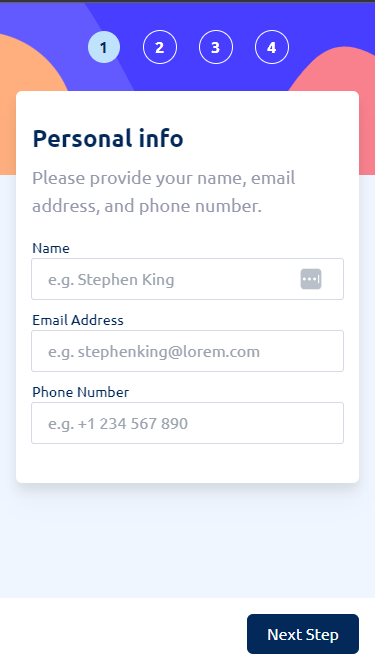
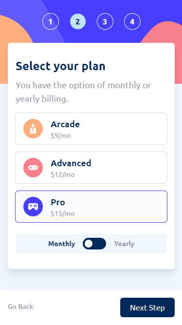
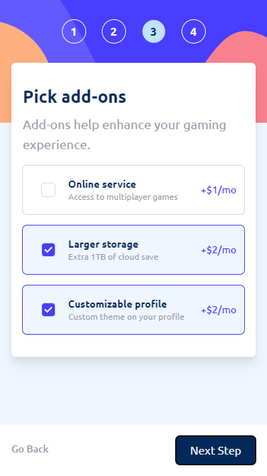
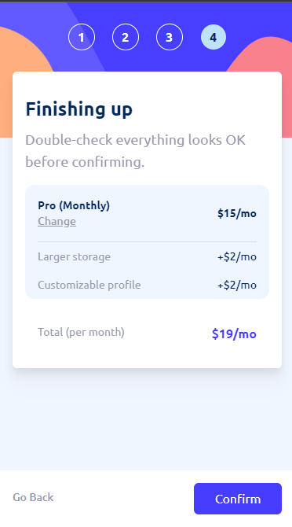

# Frontend Mentor - Multi-step form solution

[Live Site URL (Netlify)](https://master--benevolent-toffee-cc941b.netlify.app/)

This is my solution to the [Multi-step form challenge on Frontend Mentor](https://www.frontendmentor.io/challenges/multistep-form-YVAnSdqQBJ). Frontend Mentor challenges help you improve your coding skills by building realistic projects. 

## Table of contents

  - [Overview](#overview)
    - [The challenge](#the-challenge)
    - [Intentionally missing features](#intentionally-missing-features)
    - [Screenshots](#screenshots)
    - [Links](#links)
  - [My process](#my-process)
    - [Built with](#built-with)
    - [What I learned](#what-i-learned)
    - [Learning opportunities I intentionally avoided](#learning-opportunities-i-intentionally-avoided)
    - [Continued development](#continued-development)
  - [Author](#author)
  - [Acknowledgments](#acknowledgments)

## Overview

### The challenge

Users should be able to:

- Complete each step of the sequence
- See a summary of their selections on the final step and confirm their order
- View the optimal layout for the interface depending on their device's screen size
- See hover and focus states for all interactive elements on the page

### Intentionally missing features

 - Only mobile layout (might do later)
 - No form validation (I feel pretty confident in my ability to do this otherwise)
 - No thank you page

### Screenshots

### Links

- Live Site URL: [Netlify](https://master--benevolent-toffee-cc941b.netlify.app/)

## My process

### Built with

- Mobile-first workflow
- [Tailwind CSS](https://tailwindcss.com/)
- [Svelte](https://svelte.dev/) - JS library
- [SvelteKit](https://kit.svelte.dev/) - Unnecessary SSR

### What I learned

 - Had to remember how to use SVG's, probably will have to re-learn it again
 - It's not worth dealing with theming for [Svelte Material UI](https://sveltematerialui.com/). If it's an easy component (toggle switch), just build it from scratch.
 - How to build modern "checkboxable" components
   - Using `peer` and `peer:` pseudo-selector in Tailwind

### Learning opportunities I intentionally avoided

 - The main content getting too large for the page
   - What I should have done: figured out how to make the entire layout expand to fit the contents
   - What I did instead: made everything smaller
 - My file structure in SvelteKit projects is abismal
   - What I should have done: cleaned up my file structure
   - What I did instead: left everything in the `routes` directory except for one component even though this app is a SPA which doesn't need an SSR framework

### Continued development

I want to get better at setting up projects more effectively for mobile-first development. Maybe there's a better way than setting a page size or using DevTools console to set device viewport. I found the process I followed somewhat unsatisfying.

## Author

- Website (Linktree) - [Spencer Baumruk](https://linktr.ee/spencerbaumruk)
- Frontend Mentor - [@sbaumruk](https://www.frontendmentor.io/profile/sbaumruk)

## Acknowledgments

 - [Code a Program](https://www.youtube.com/watch?v=odqNMNKccjE) on YouTube with a stellar tutorial for making a toggle switch with Tailwind